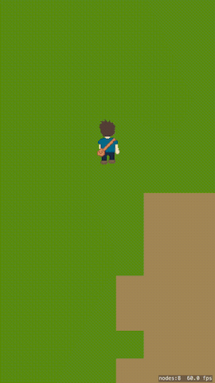
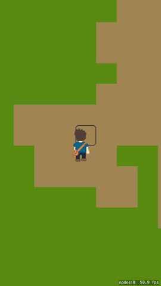
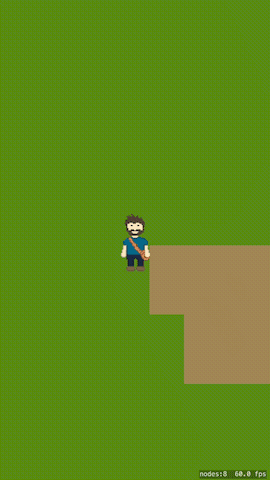

#SKTileMapExample
SKTileMapExample is a simple top down example of using Apple’s new SKTileMap API with an analog touch controller.

##Analog Touch Controller
The analog touch controller appears where the user touches making it easy to control the character without concerning themselves with finger placement.

When moved within the inner circle it controls the direction of the player without moving him. This makes it easy to look at something near without moving all over the place.

When moved outside the inner circle it controls movement and normalizes 

##Camera 

Camera is set to follow the player while not going outside the map bounds.

##Player

Player is created from a single sprite sheet.

Permission is hereby granted, free of charge, to any person obtaining a copy
of this software and associated documentation files (the "Software"), to
deal in the Software without restriction, including without limitation the
rights to use, copy, modify, merge, publish, distribute, sublicense, and/or
sell copies of the Software, and to permit persons to whom the Software is
furnished to do so, subject to the following conditions:

The above copyright notice and this permission notice shall be included in
all copies or substantial portions of the Software.

THE SOFTWARE IS PROVIDED "AS IS", WITHOUT WARRANTY OF ANY KIND, EXPRESS OR
IMPLIED, INCLUDING BUT NOT LIMITED TO THE WARRANTIES OF MERCHANTABILITY,
FITNESS FOR A PARTICULAR PURPOSE AND NONINFRINGEMENT. IN NO EVENT SHALL THE
AUTHORS OR COPYRIGHT HOLDERS BE LIABLE FOR ANY CLAIM, DAMAGES OR OTHER
LIABILITY, WHETHER IN AN ACTION OF CONTRACT, TORT OR OTHERWISE, ARISING
FROM, OUT OF OR IN CONNECTION WITH THE SOFTWARE OR THE USE OR OTHER DEALINGS
IN THE SOFTWARE.
